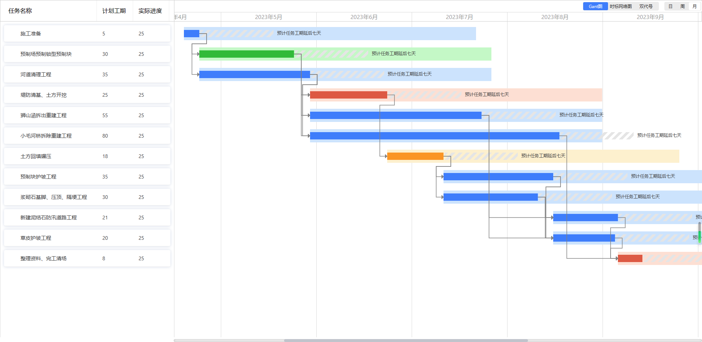
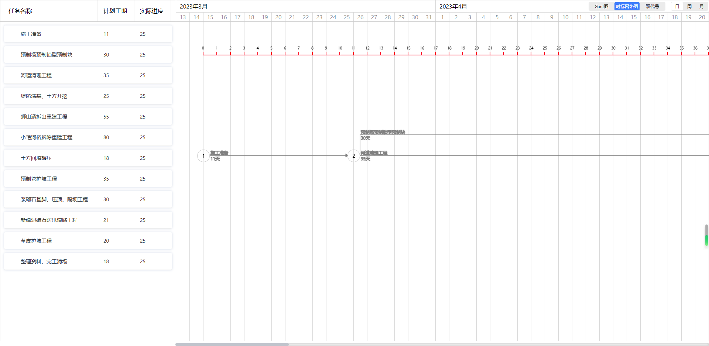
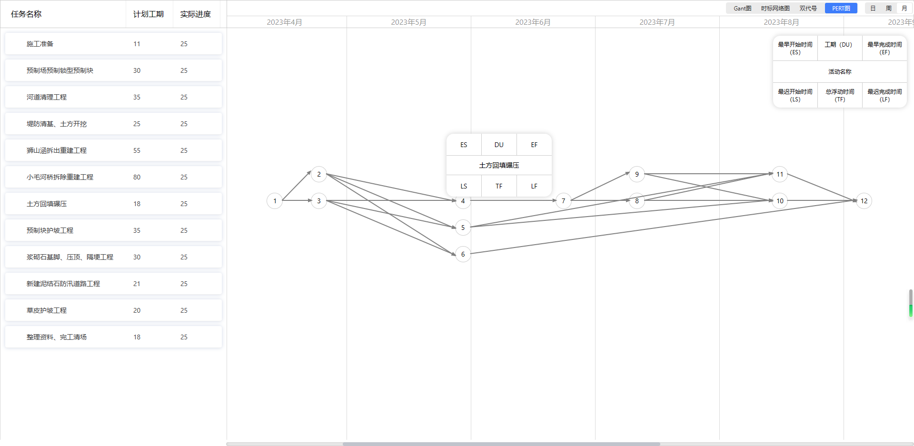
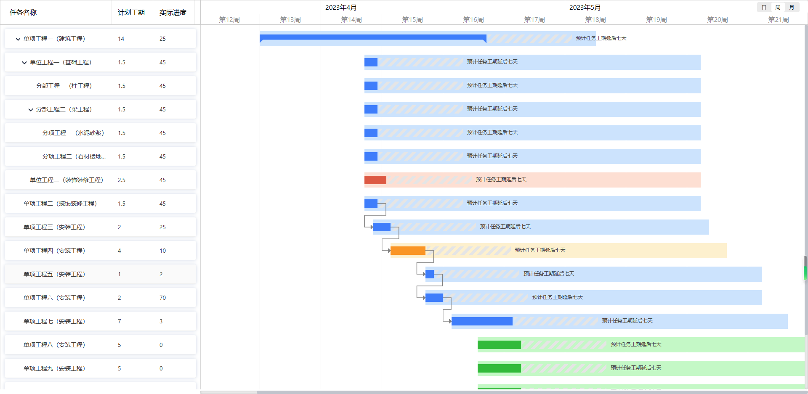
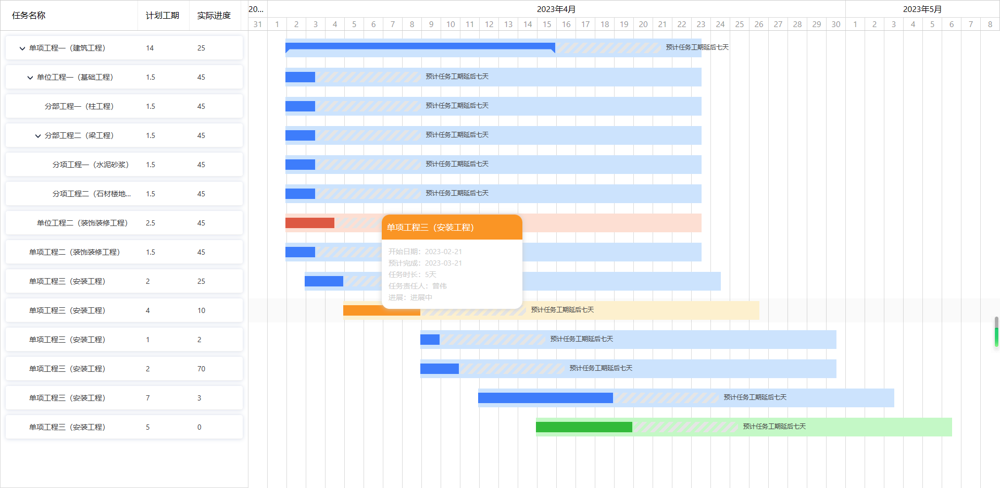
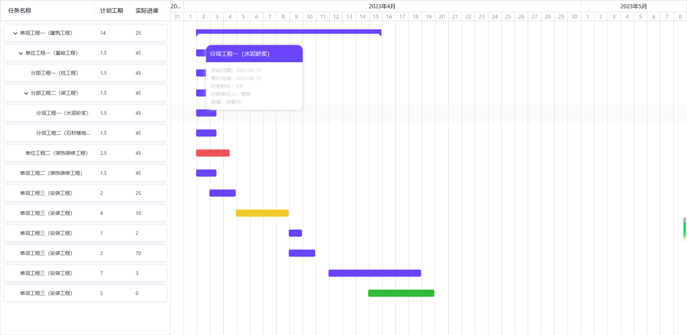
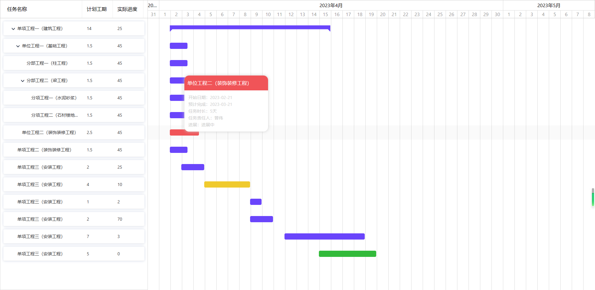

	

	<strong style="font-size: 24px">飞椽4合一网络图引擎（更懂工程人的进度引擎）-- Gantt图+时标网络图+双代号（箭线图）+PERT图（单代号前导图），更直观便捷的让您随时随地掌控项目进度，给您不一样的进度管理体验</strong>

	
	
    

	<a href="https://gantt.bimcc.net/" target="_blank">在线演示</a> &nbsp;|
	<a href="http://www.bimcc.com/" target="_blank">飞椽零代码</a>&nbsp;|
    <a href="https://gantt.bimcc.net/network-diagram" target="_blank">4合一引擎演示</a>&nbsp;|
    <a href="https://gitee.com/zw12579/gantt-planing-network" target="_blank">码云仓库</a>&nbsp;|
    <a href="https://github.com/zw12579/gantt-planing-react" target="_blank">Github仓库</a>

### 功能速览

- - [x] 完美兼容Project数据标准，支持project数据导入导出、PNG、PDF导出

- - [x] 任意自主设计网络图、节点拖动、箭线调整等、一键逆向生成Gantt图、时标网络图、双代号、PERT图

- - [x] 任务自定义告警等级颜色以及告警规则

- - [x] 无限级任务树，支持大量数据虚拟滚动加载优化

- - [x] 自定义网络图样式（一键换肤、内置多套皮肤）

- - [x] 日、周、月、季、年、时六级切换

- - [x] 进度bar任务概览

- - [x] 基线对比，实际与计划进度对比，预计提前与滞后工程量计算

- - [x] 进度计划拖拽调整、前置后置连线联动

- - [x] 里程碑标识节点

- - [x] 自定义字段，任务字段宽度拖拽调整

- - [x] 任务栏与进度栏区域调整，任务栏显示隐藏

- - [x] 自动生成WBS字段

- - [x] 灵活的事件扩展机制

- - [x] 前置后置关系（SS、SF、FS、FF）

- - [x] 周六日非工作时间标识

- - [x] 日期进度调整联动修改

- - [x] 任务快捷添加、编辑、升级、降级、删除（Tab、Enter、DELETE）

- - [x] 进度检查点标记线

- - [x] 检查点进度前锋线

- - [x] 关键路径自动计算（甘特图、时标、单双代号），关键路径特殊颜色标识

- - [x] 任务进度S曲线

- - [x] 人、机、资源分配及消息提醒

- - [x] 甘特图、时标网络图、单代号（前导图、PERT图、七格图）、双代号（箭线图）

- - [x] 4合一引擎，数据互通无缝切换

- - [x] 日历任务待办视图转换（日程转化）

### 特别说明

- 开源不易，如蒙青睐，希望您动动发财的小手点点Star，以上功能源码正逐步开放中，谢谢大家
- 飞椽零代码平台请访问 www.bimcc.com   ©重庆市筑云科技有限责任公司  **023-68682379**
- 提供案例代码及API文档，后续支持React与Vue 插件引入（NPM包）
- 交流学习群: 451367009 欢迎大家一起交流学习

### 案例截图

    
    
    
    
    
	
    
    
    

