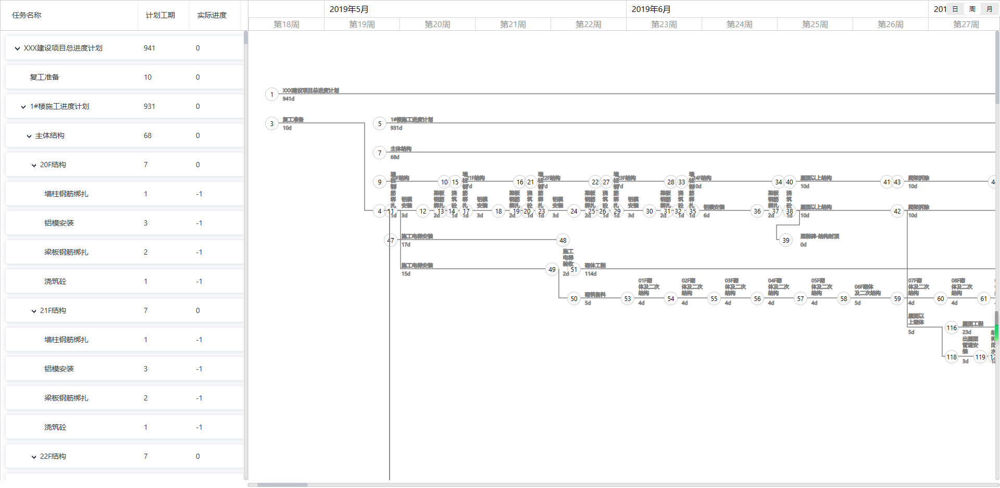
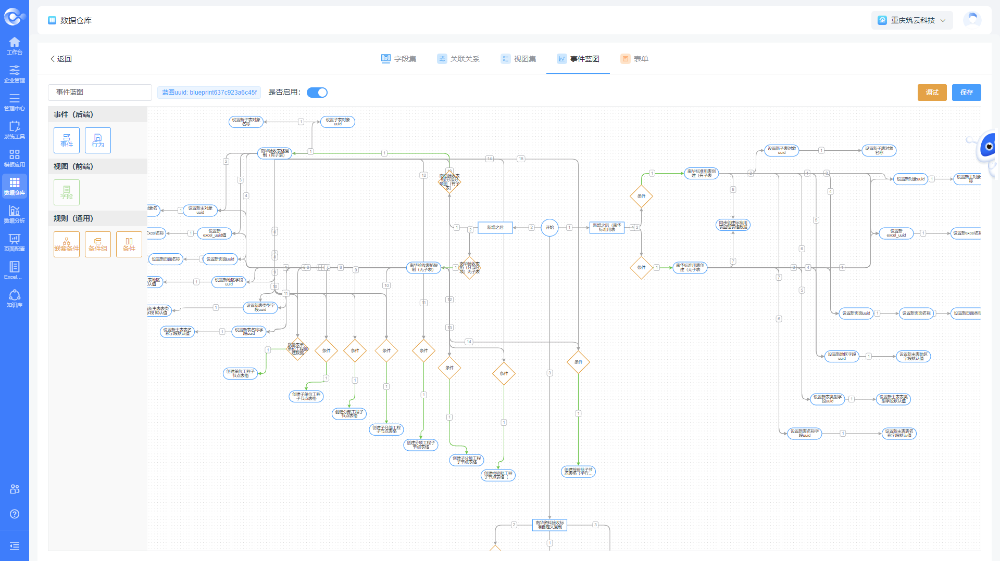
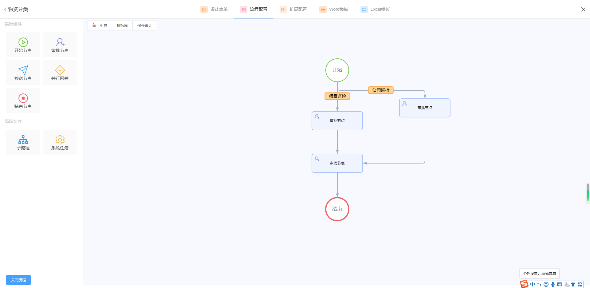
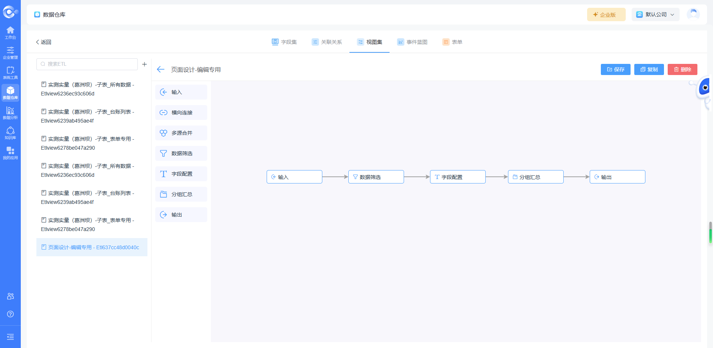
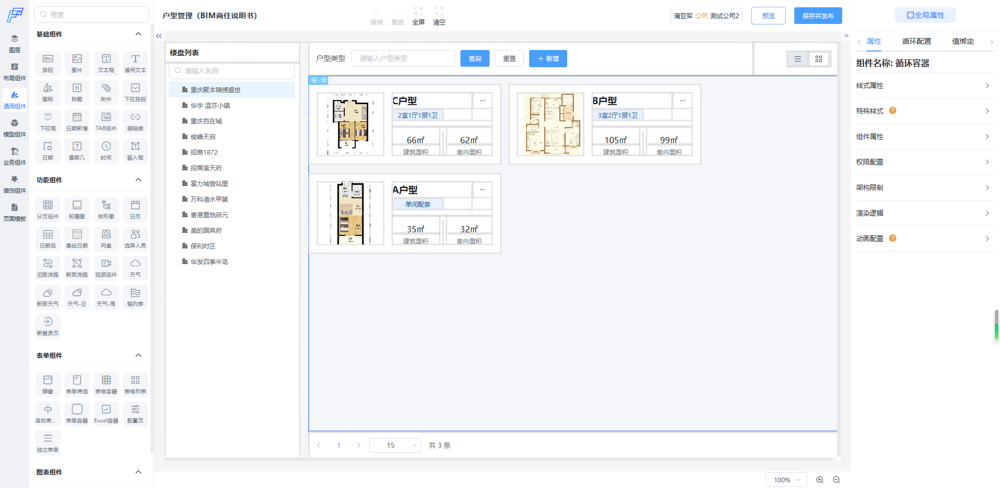
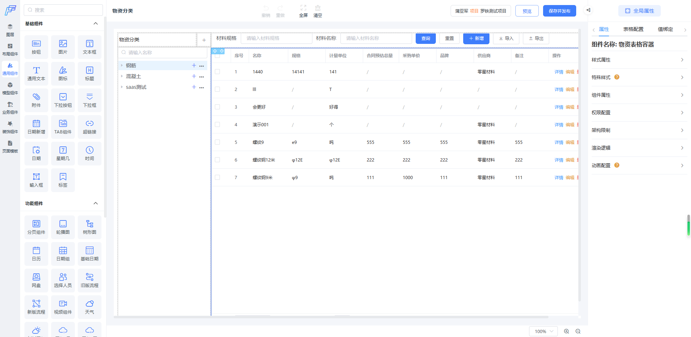

	

	<strong style="font-size: 24px">飞椽4合一网络图引擎（更懂工程人的进度引擎）-- Gantt图+时标网络图+双代号（箭线图）+PERT图（单代号前导图），更直观便捷的让您随时随地掌控项目进度，给您不一样的进度管理体验</strong>

	
	
    

	<a href="https://gantt.bimcc.net/" target="_blank">在线演示</a> &nbsp;|
	<a href="http://www.bimcc.com/" target="_blank">飞椽零代码</a>&nbsp;|
    <a href="https://gantt.bimcc.net/network-diagram" target="_blank">4合一引擎演示</a>&nbsp;|
    <a href="https://gitee.com/zw12579/gantt-planing-network" target="_blank">码云仓库</a>&nbsp;|
    <a href="https://github.com/zw12579/gantt-planing-react" target="_blank">Github仓库</a>

### 特别说明

- 开源不易，如蒙青睐，希望您动动发财的小手点点Star，以下功能源码正逐步开放中，谢谢

- 提供案例代码及API文档，提供React与Vue （NPM包）插件安装

- 4合一网络图交流学习群: 451367009 欢迎大家一起交流学习，作者QQ：1257956488

- 飞椽零代码平台请访问 www.bimcc.com   ©重庆市筑云科技有限责任公司  **023-68682379**

  

### 功能速览

- - [x] 完美兼容Project数据标准，支持project数据导入导出、PNG、PDF导出

- - [x] 任意自主设计网络图、节点拖动、箭线调整等、一键逆向生成Gantt图、时标网络图、双代号、PERT图

- - [x] 任务自定义告警等级颜色以及告警规则

- - [x] 无限级任务树，支持大量数据虚拟滚动加载优化

- - [x] 自定义网络图样式（一键换肤、内置多套皮肤）

- - [x] 日、周、月、季、年、时六级切换

- - [x] 进度bar任务概览

- - [x] 基线对比，实际与计划进度对比，预计提前与滞后工程量计算

- - [x] 进度计划拖拽调整、前置后置连线联动

- - [x] 里程碑标识节点

- - [x] 自定义字段，任务字段宽度拖拽调整

- - [x] 任务栏与进度栏区域调整，任务栏显示隐藏

- - [x] 自动生成WBS字段

- - [x] 灵活的事件扩展机制

- - [x] 前置后置关系（SS、SF、FS、FF）

- - [x] 周六日非工作时间标识

- - [x] 日期进度调整联动修改

- - [x] 任务快捷添加、编辑、升级、降级、删除（Tab、Enter、DELETE）

- - [x] 进度检查点标记线

- - [x] 检查点进度前锋线

- - [x] 关键路径自动计算（甘特图、时标、单双代号），关键路径特殊颜色标识

- - [x] 任务进度S曲线

- - [x] 人、机、资源分配及消息提醒

- - [x] 甘特图、时标网络图、单代号（前导图、PERT图、七格图）、双代号（箭线图）

- - [x] 4合一引擎，数据互通无缝切换

- - [x] 日历任务待办视图转换（日程转化）

### 案例截图

    
    
    
    
    
     
    
    
	
    

### 发布计划

| 版本 | 功能说明                                                     | 计划日期                |
| ---- | ------------------------------------------------------------ | ----------------------- |
| V1.0 | 开源版：甘特图（工具栏功能）、接口文档、Vue/React NPM插件    | 2023-07-20              |
| V2.0 | 标准版：Gantt图 + PERT网络图（单代号-七格图）                | 2023-08-20              |
| V3.0 | 专业版：4合一网络图引擎 - Gantt图+时标网络图+双代号+PERT     | 2023-08-30 - 2023-09-30 |
| V4.0 | 小微版：Gantt图、时标网络图、双代号网络图、PERT图（单版本授权） | 2023-08-30 - 2023-09-30 |

- V1.0版本发布计划
  - 甘特图：自定义任务标题栏显示字段
  - 甘特图：任务标题栏宽度拖拽
  - 甘特图：任务栏数据行内编辑
  - 甘特图：任务栏拖动调整顺序，升级降级
  - 甘特图：任务栏无限级、任务横道展开收起联动
  - 甘特图：WBS任务自动编码
  - 甘特图：任务栏/横道图显示隐藏，分割面板左右拖动改变宽度
  - 甘特图：日、周、月、年4级切换
  - 甘特图：快捷键：Enter 新增一行数据
  - 甘特图：快捷键：Shift+Tab 升级  Tab 降级
  - 甘特图：快捷键：Ctrl + Z、X、C、V 撤销、剪切、复制、粘贴
  - 甘特图：快捷键：Ctrl + D、Delete删除
  - 甘特图：鼠标移入横道任务气泡概览
  - 甘特图：大数据无卡顿虚拟滚动
  - 甘特图：鼠标长按画布移动画布
  - 甘特图：自动保存、历史版本选择
  - 甘特图：双击任务栏定位
  - 甘特图：项目、任务、里程碑
  - 甘特图：实际进度拖拽
  - 甘特图：横道自由拖拽（任务日期联动修改）
  - 甘特图：甘特图事件回调扩展
  - 甘特图：API文档与示例代码演示
  - 甘特图：Vue3/React npm插件
  
- V2.0版本发布计划
  - 甘特图：快捷工具栏（升级降级，自动、手动任务，上下移动，任务、里程碑新增，版本选择，检查线、前锋线、进度曲线等快捷按钮）
  - 甘特图：MPP文件导入
  - 甘特图：检查点标记线
  - 甘特图：进度前锋线
  - 甘特图：连线拖拽
  - 甘特图：非工作日标识
  - 甘特图：SF、SS、FS、FF依赖关系
  - 甘特图：进度S曲线
  - 甘特图：关键路径、关键路径动画模拟
  - 甘特图：进度模拟播放
  - 甘特图：预估完成时间计算
  - 甘特图：预计提前与滞后工期计算
  - 甘特图：基线计划对比
  - 甘特图：自定义任务颜色
  - 甘特图：多套样式切换，一键换肤
  - 甘特图：自定义告警规则
  - 甘特图：Project（MPP文件）导出、PDF导出、Excel（XML）导入导出
  - PERT图：PDF导出、PNG图片导出
  - PERT图：甘特图+PERT图相互转换
  - PERT图：最早开始、最早完成、最晚开始、最晚完成、持续时间、自由活动时间、总浮动时间
  - PERT图：PERT关键路径标识
  - PERT图：节点拖动、拖拽连线

- V3.0版本发布计划

  - 4合一网络图：授权管理，鉴权验证，授权续签等
  - 4合一网络图：在线协同，实时共享协作与互动讨论，IM协同
  - 4合一网络图：快捷工具栏，功能升级扩展
  - 4合一网络图：任务栏分组（按人员、自定义字段）
  - 4合一网络图：网络图模板
  - 4合一网络图：工序节点自由拖拽新增
  - 4合一网络图：首尾节点拖动，连线，同步修改依赖关系与日期（XY坐标）
  - 4合一网络图：布局算法优化，虚活动与实活动连线重合，设置偏移量
  - 4合一网络图：网络图鼠标左键长按移动网络图画布
  - 4合一网络图：选中左侧任务，定位并选中双代号连线
  - 4合一网络图：网络图ctrl+鼠标滚动放大缩小网络图
  - 4合一网络图：框选选中任务及连线（左右选中同步并定位）
  - 4合一网络图：选中连线上下左右移动，调整连线拐点
  - 4合一网络图：网络图打印设置，导入导出（图片、PDF、MPP）
  - 4合一网络图：右键菜单操作（网络图样式、图注、特殊格式）
  - 4合一网络图：父子级包含色块标识，层级横道分组（类斑马进度分组方式）
  - 4合一网络图：Ctrl+F 弹出输入框查找并定位任务，查找结果特殊颜色标注
  - 4合一网络图：Ctrl+R 弹出替换输入框，任务名称替换，查找结果特殊颜色标注

  ————————————————————————————————————————————

  - 4合一网络图：网络图本地打开，本地化保存，定义数据标准后缀名（迭代升级计划）
  - 4合一网络图：网络图制图说明（类似CAD）（迭代升级计划）
  - 4合一网络图：网络图资源管理面板视图（迭代升级计划）
  - 4合一网络图：工程标尺（时标刻度）优化（按网络图比例缩小或放大刻度）智能调图（迭代升级计划）
  - 4合一网络图：节点连线交叉点桥洞线处理（迭代升级计划）
  - 4合一网络图：日历、日程任务视图切换（迭代升级计划）
  - 4合一网络图：移动端兼容，手机看图（迭代升级计划）
  - 4合一网络图：多端跨平台兼容，客户端、APP（迭代升级计划）

- V4.0  单版本授权发布计划

  - 甘特图：单独商用授权的全功能版甘特图
  - 时标网络图：单独商用授权的全功能版时标网络图
  - 双代号网络图：单独商用授权的全功能版双代号网络图
  - 单代号（PERT）网络图：单独商用授权的全功能版单代号（PERT）网络图
  - 4合一网络图：自由选择，多种组合（二合一、三合一自由组合）
  
  

### PS：飞椽零代码平台

	<strong style="font-size: 16px;line-height:35px;">&nbsp;&nbsp;&nbsp;&nbsp;飞椽云-泛工程零代码平台是面向建设工程领域基于项企协同管理体系的信息系统数字化、智能化建设的一站式全场景落地的解决方案。平台结合SaaS、PaaS、IaaS系统（既是软件也是服务更是基础设施）的技术发展新趋势及应用新场景，融合工程建设企业与项目的行业特点打造，是一个具有项企联动体系的多层级架构，垂直行业软件应用体系、多方协同的BIMGIS + AIoT 一体化系统。系统采用平台化设计、网络化协同、个性化定制、服务化延伸，贯通工程制造领域全场景、全过程、基于数据的集成化应用落地。具有包含流程引擎、BIMGIS引擎、表格引擎、甘特图网络图引擎等10大自主引擎及物联网中台、数据中台所形成的10+2能力架构，通过10+2能力架构可覆盖工程行业绝大部分的项目管理的数字化转型基座能力要求。通过该平台无代码、可视化的效率特性，以业务需求为导向，数据驱动为核心，网络化协同为辅助，以价值驱动为目标，敏捷地帮助企业和项目打造如数字建造系统、项目管理系统、智慧工地系统、BIMGIS协同系统、工程数字孪生系统、智能运维系统、企业级业务管理（生产、安全、技术质量等）系统等，并基于灵活的基础库能力，适应建筑工程、市政工程、道路交通工程、水运工程、水利工程等多类型工程领域，帮助用户以低成本、短周期、高效率的方式实现各类数字化应用。</strong>

#### 10大引擎+2个中台

- 元数据建模（数据智仓）引擎
- 无代码页面渲染引擎（常规页面、APP/H5、大屏、工作台图表）
- BIMGIS数字孪生引擎
- 表单引擎
- 流程引擎
- 逻辑蓝图&ETL视图引擎
- 数据表格引擎（自研在线Excel）
- 360°全景引擎（低延时全景直播）
- 任务自动化引擎
- 飞椽4合一网络图引擎(Gantt图+时标网络图+双代号+PERT图)
- 数据中台（元数据、数据仓湖一体、数据治理、数据集、数据服务、数据质量）
- 物联网中台（常见物联网协议、TCP/IP自定义协议、MQTT、数据转发）

    
     
    
     
    
     
    
     
    
     
    
     
    

